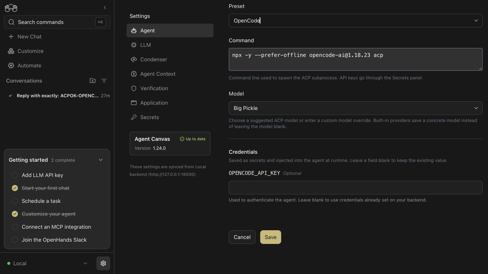

# OpenHands #17696 review pack

This is the temporary review package for PR #17758. Remove `.pr/` before merge; it is not shipped product documentation.

## Solution documents

- [October 1 review revision — compatibility, command ownership and validation](./REVIEW-REVISION.html)
- [English solution](./SOLUTION.md)
- [中文方案](./SOLUTION.zh-CN.md)

## Diagrams

| Topic                           | English                                | 中文                                               |
| ------------------------------- | -------------------------------------- | -------------------------------------------------- |
| Responsibility and runtime flow | [architecture.svg](./architecture.svg) | [architecture.zh-CN.svg](./architecture.zh-CN.svg) |
| Verification ladder             | [validation.svg](./validation.svg)     | [validation.zh-CN.svg](./validation.zh-CN.svg)     |

## Runtime screenshots

- [October 1: OpenCode Profile after save and reload](./opencode-revision-model.jpg)
- [October 1: real OpenCode conversation](./opencode-revision-reply.jpg)
- [October 1: Profile editor context](./opencode-revision-profile.jpg)

The September 28 captures below are historical evidence from the original PR revision, not the latest UI.
- [OpenCode preset, command, model, credential and connected local backend](./opencode-preset-settings.jpg)
- [Real OpenCode ACP conversation identifying the preset and `opencode/big-pickle`](./opencode-real-conversation.jpg)

## Remaining gates

- New remote CI and independent review are still required.
- A maintainer must label #17696 `enhancement` for the feature-PR gate.
- Do not describe the full macOS suite as green: two unchanged-main Docker shell tests fail with Bash 3.2. Details and the upstream reproduction are in the revision document.
