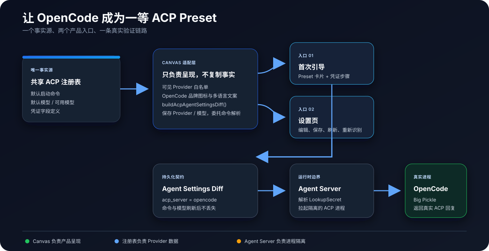
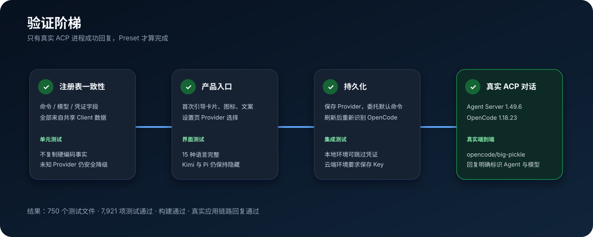

# 将 OpenCode 升级为一等 ACP Preset

## 我想解决什么问题

OpenCode 已经存在于共享 ACP Provider 注册表里，也已经能通过 ACP 启动。但在 Agent Canvas 中，用户仍然只能选择 **Custom ACP**，然后重新填写产品本来就知道的信息：启动命令、默认模型和凭证字段。

这在代码上看起来只是少了一个入口，但在产品上意味着“底层支持、前台却不可发现”。我希望把这段体验补完整，同时避免在 Canvas 里再造一份 Provider 注册表。



## 原有链路与问题根因

改动前，系统的真实情况是：运行时已经能拉起 OpenCode，但产品层没有把它当作正式支持的选项。

1. 共享 TypeScript Client 注册表已经定义了 `opencode`。
2. Canvas 会读取注册表，但它自己的 UI 可见白名单里没有 OpenCode。
3. 用户只能使用 Custom ACP，手动重填注册表已经拥有的数据。
4. 手动配置可能随版本变化产生漂移，而且没有专属图标、多语言解释和凭证引导。
5. 真实 ACP 测试已覆盖 Codex、Claude Code 和 Gemini CLI，却没有覆盖“Canvas 自己构造请求并启动 OpenCode”的完整链路。

所以根因不是 ACP 协议缺失，也不是 Agent Server 缺接口，而是**产品展示、配置持久化和真实验证之间没有闭环**。

## 设计原则

### 1. Provider 数据只能有一个事实源

OpenCode 的命令、模型列表和凭证定义仍由 `@openhands/typescript-client` 管理。Canvas 只维护它真正应该负责的产品信息：

- 当前是否对用户可见；
- 使用什么品牌图标；
- 使用什么本地化文案。

测试会直接对比 Canvas 与共享注册表中的数据。如果未来上游命令或模型发生变化，而 Canvas 没有正确读取，测试会立即失败。

### 2. 默认命令仍由注册表负责

评审提醒我，复制默认命令到持久化设置会把 CLI 版本固化。我已移除 OpenCode 的特殊分支：引导保存 `acp_command: []`，与其他内置 Preset 一致；最新主线的 Profile 编辑器保存 `acp_command: null`，由后端解析当前注册表默认值。

刷新后编辑器仍展开当前默认命令并识别 OpenCode，但升级注册表不会被旧命令绑住。引导保存的 Diff 是：

```json
{
  "agent_kind": "acp",
  "acp_server": "opencode",
  "acp_command": [],
  "acp_args": [],
  "acp_model": "opencode/big-pickle"
}
```

同时会显式清空 `acp_args`，避免旧的自定义参数在启动时被意外拼接到新命令后面。

### 3. 明确区分本地与云端凭证逻辑

共享注册表只声明了 `OPENCODE_API_KEY`，因此 Canvas 不会凭空增加 Base URL 等字段。该字段按 Secret 处理。

- 本地 Agent Server 可以跳过凭证步骤，因为 OpenCode 可以复用本机 `opencode auth login`，默认 Big Pickle 路径也可以在没有 Key 时完成 smoke test。
- 云端 Agent Server 不能假设能访问用户电脑上的登录态，因此必须先保存注册表声明的 Key。
- 如果提供了 Key，应用会通过 `LookupSecret` 传递引用，不会把明文写进会话 Payload 或测试日志。

### 4. 不突破现有职责边界

这次不会新增 Agent Server API，也不会修改 ACP 协议。Canvas 负责保存 Settings Diff；Agent Server 负责解析 Secret、隔离并拉起进程；OpenCode 负责自己的模型执行。

## 具体实现

| 模块          | 改动                                                             | 目的                                               |
| ------------- | ---------------------------------------------------------------- | -------------------------------------------------- |
| Provider 展示 | 将 OpenCode 加入 UI 可见映射                                     | 让已支持的 Provider 可发现，同时不暴露全部实验条目 |
| 品牌系统      | 为 `AgentBrandIcon` 增加 OpenCode 图标                           | 不再把正式支持的 Provider 显示成匿名终端命令       |
| 首次引导      | 增加 OpenCode 卡片与凭证步骤                                     | 与其他一等 Provider 保持一致的首次使用路径         |
| 设置持久化    | 保存 Provider 与首选模型、委托默认命令解析，并清空旧 `acp_args`                    | 确保保存、刷新和重新识别不丢信息                   |
| 多语言        | 补齐 15 种语言描述                                               | 保持翻译完整性门禁通过                             |
| 真实测试      | Live ACP Harness 增加 OpenCode、认证型本地 Server 与可配置工作区 | 验证 Canvas 自己的请求构造链路，而不是只测 UI      |
| 文档          | 更新 ACP 使用说明与测试矩阵                                      | 让支持范围和证据可被维护者复核                     |

## 我刻意没有做的事情

- 没有顺手开放 Kimi Code 和 Pi；这不是“一次性展示所有注册表条目”的改动。
- 没有改变 Codex、Claude Code、Gemini CLI 的命令持久化语义。
- 没有新增 Agent Server 接口。合入最新主线后，最低版本为 **1.47.0**；OpenCode 在 1.45.0 才进入后端的闭合类型。我保留了主线更高的门槛。
- 没有让 Canvas 接管 Provider 的模型目录或凭证所有权。
- 默认真实验证不强制要求 OpenCode API Key。

## 验证方案

我把验证拆成四层，避免“界面测试是绿的，但真实进程根本拉不起来”：



### 自动化覆盖

- 注册表一致性：校验展示名、命令、模型和 Secret 定义均来自共享 Client Registry。
- 首次引导：校验可见性、选择行为、品牌图标、Settings Diff、本地跳过和云端凭证门禁。
- 设置持久化：验证 Profile 展示当前命令与模型，默认命令保存为 `null` 后仍能重新识别；引导测试验证空命令 Diff；兼容性测试拒绝 1.28.0 与 1.44.99。
- 多语言：校验 15 种语言全部包含新增文案。
- Live ACP Harness：加入 OpenCode，并支持带 Session API Key 的本地 Agent Server。

### 9 月 28 日原始自动化结果（历史记录，非修订后的 Head）

```text
Test Files  750 passed (750)
Tests       7921 passed | 7 todo (7928)
Build       PASS
Translations PASS
```

### 9 月 28 日原始应用链路（历史记录）

我启动了 Agent Server 1.49.6 与 Agent Canvas 1.24.0，通过应用实际使用的 Settings Builder 保存 OpenCode Preset，创建新会话，并等待执行进入终态。

```text
PATCHed agent settings: {"acp_server":"opencode","acp_model":"opencode/big-pickle"}
conversation created; polling…
status=finished reply="OpenCode ACP preset is running with model opencode/big-pickle"
PASS
```

为了让评审证据本身就能说明问题，我通过 Harness 新增的可选 `ACP_E2E_EXPECTED_REPLY` 参数，让回复直接写明所选 Preset 与模型，而不是只返回含义不明显的 smoke-test token。默认的短 token 测试行为保持不变。

下面两张截图来自完成这次真实应用链路验证后的同一套本地运行环境。设置页截图展示了独立 OpenCode Preset、注册表命令、Big Pickle、唯一的 `OPENCODE_API_KEY` 字段，以及左下角绿色的本地连接状态；会话截图直接说明正在运行 OpenCode ACP Preset 与 `opencode/big-pickle`，且没有断连 Toast 或失败状态。


此前那张“会话成功但服务已经停止”的截图不会再使用。

## 风险与应对

| 风险                          | 应对方式                                         |
| ----------------------------- | ------------------------------------------------ |
| Canvas 与注册表发生漂移       | 直接读取注册表，并增加字段一致性测试             |
| 自定义命令被误识别成 OpenCode | 使用注册表精确命令进行 Preset 检测               |
| 旧 ACP 参数污染新 Preset      | 保存时显式重置 `acp_args`                        |
| 本地登录态与云端凭证逻辑混淆  | 分别覆盖“本地可跳过”和“云端必须有 Key”           |
| UI 正常但真实进程启动失败     | 运行 Agent Server + OpenCode 的真实 App-path E2E |
| 改动范围扩散到未评审 Provider | 使用明确白名单，Kimi Code 与 Pi 继续隐藏         |

## 回滚方案

改动集中在 Canvas 展示映射、图标文案、文档和测试。OpenCode 使用现有注册表默认命令语义。如果需要撤回，只要从 UI 可见映射中移除 OpenCode，就可以重新隐藏入口，不需要修改共享注册表或 Agent Server；已有 Custom ACP 配置仍然能够继续使用。

## 验收标准

- 首次引导与设置页中出现独立的 OpenCode 选项。
- OpenCode 图标与本地化描述正确展示。
- 凭证步骤只展示 `OPENCODE_API_KEY`。
- 本地环境无 Key 可继续，云端环境无 Key 不可继续。
- 保存 `opencode` 与 `opencode/big-pickle`，但不把默认命令复制到持久化设置。
- 刷新后配置不丢失，并能重新识别为 OpenCode Preset。
- 其他已展示 Provider 的行为保持不变。
- 真实 App-path 会话进入 `finished` 并返回预期的 OpenCode 回复。

## 10 月 1 日评审修订

已合入 `a8c05584e` 主线，保留 1.47.0 最低版本，移除默认命令固化。详见含对比图的[修订文档](./REVIEW-REVISION.html)，以及新采集的[Profile 截图](./opencode-revision-model.jpg)与[真实回复](./opencode-revision-reply.jpg)。

183 条针对性测试通过；lint 零错误、应用构建、SDK 构建与翻译完整性通过。全量：763 个文件、8,061 条测试通过，7 条 todo；macOS Bash 3.2 下两条 Docker shell-policy 测试失败。直接执行未改动的主线片段可复现同样的 exit 127：`set -u` 下空数组报 unbound variable。我没有把全量测试写成全绿。

真实链路使用 Agent Server 1.49.6、OpenCode 1.18.23、`opencode/big-pickle`；空命令 Diff 成功启动并进入 finished。真实生产界面完成选择、跳过本地密钥、得到回复、保存 Profile、刷新并重新打开；SDK 读取确认 `acp_command: null`。没有在真实后端模拟注册表升级，默认解析语义由回归测试覆盖。
